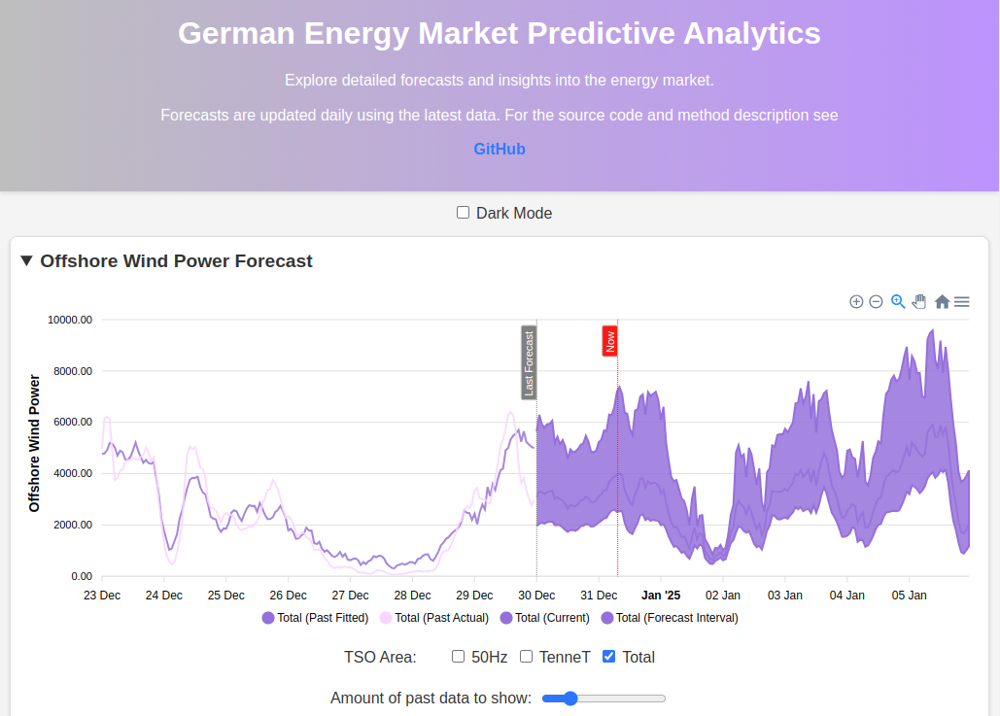

# MLOps-Driven Energy Forecasting: Week-Ahead Insights for a Sustainable Future

This project leverages advanced MLOps pipelines to deliver accurate week-ahead forecasts of renewable energy generation, electricity load, and prices. By combining robust data engineering, state-of-the-art machine learning models, and scalable automation, it empowers stakeholders to optimize operations, enhance trading strategies, and support sustainable energy integration in a dynamic market environment.

Live version: https://vsevolodnedora.github.io/energy_market_analysis/ 

## MWP and Value Proposition



## Value Proposition

__Week-ahead accurate forecasts of renewable energy generation, load, and electricity prices__ empower energy market participants to:

- **Optimize Operations and Maintenance**: Schedule maintenance and operational changes efficiently, minimizing disruptions and costs.
- **Enhance Trading and Risk Management**: Improve bidding strategies, reduce financial risks, and align operations with market conditions for increased profitability.
- **Support Grid Stability and Renewable Integration**: Balance supply and demand effectively, enabling seamless integration of variable renewable energy sources.
- **Drive Sustainability and Long-term Planning**: Provide actionable insights for decarbonization goals, policy design, and grid modernization efforts.

This project delivers practical tools and insights for utilities, grid operators, energy traders, and policymakers, fostering a more efficient, reliable, and sustainable energy system.


## Core Features and Workflow

---

- **Daily Data Collection**: Automated data retrieval from public APIs and webpages. Data is collected daily via GitHub Actions and appended to their respective datasets inside the `database/`.
    - [SMARD](https://www.smard.de/home): Accurate _aggregated over Germany_ energy-related quantities, e.g., generation per type (and their day-ahead forecasts), load (and its forecast), cross-border flow.
    - [ENTSO-E](https://transparency.entsoe.eu/): Energy-related quantities for each TSO-controlled region, e.g., generation from renewables for each TSO (Amprion, 50Hz, TenneT, TransnetBW).
    - [openmeteo](https://open-meteo.com/): Weather quantities such as wind speed, temperature, shortwave radiation, and precipitation for multiple locations, e.g., major cities, wind, and solar farm locations.
    - [epexspot](https://www.epexspot.com/en): Day-ahead and intraday auction electricity prices. Data is retrieved from files generated by [webscraper](https://github.com/vsevolodnedora/epex_de_collector).
- **Data Cleaning and Preprocessing**: Forecasting different quantities requires different approaches.
    - _Offshore Wind Generation_: Wind generation depends primarily on weather conditions, assuming operational changes (maintenance, failures) are negligible. There are several wind farms in Germany connected to the grid by TenneT (main) and 50Hz (secondary) TSOs. Each TSO connects several geographically dispersed wind farms.
    - _Onshore Wind Generation_: Similar to offshore generation but more volatile due to rapid weather changes on land. Germany produces most of its wind energy from onshore farms connected to the grid by all four TSOs.
    - _Solar Energy_: Primarily produced by PV panels in the southeast of Germany. Generation is highly periodic (e.g., no generation at night).
    - _Gas_, _biomass_, _hard coal_, _lignite_, _waste_, _hydro_, _other fossil_, and _other renewables_: These sources either compensate for the _base load_ when renewables are weak (e.g., gas) or add to the energy mix.
- **Multi-Step Forecasting**: Each quantity needs to be forecasted many timesteps ahead. Currently, we perform a week-ahead forecast of hourly data.
    - _Main technique_: Multi-step, recursive, single-target forecasting — we forecast each timestep using the previous one (opposite to direct multi-output forecasting, where an entire array of values is generated simultaneously).
    - _Main models_: Currently, we employ Prophet (for data with clear seasonality), XGBoost, and Elastic Net (for all data), as well as ensemble models trained on out-of-sample (OOS) predictions.
- **Feature Engineering**: Each quantity is forecasted using its own selection of raw and engineered features.
    - _Offshore and Onshore Wind Generation_: We use raw weather features (e.g., wind speed, wind direction, pressure) and engineered features (e.g., air density, wind shear, wind power density) aggregated over multiple wind farm locations (e.g., using weighted average or Inverse Distance Weighting (IDW)).
- **Hyperparameter Optimization**: Model hyperparameters (e.g., `n_estimators`, `learning_rate`, etc., for XGBoost) and feature engineering hyperparameters (e.g., which features to use, lag, drop, and how to aggregate) are set automatically.
    - _Main technique_: Different combinations of model and dataset hyperparameters are considered, and the combination that gives the lowest error (root-mean-squared error averaged over the last N horizons) is chosen.
- **Pipeline Automation**: Data collection and forecast serving are done using GitHub Actions. Model and dataset hyperparameter tuning is performed on premises due to computational cost.
- **Web Integration**: Forecasts are served on a static webpage designed with HTML, JavaScript, and CSS. The webpage is deployed from a separate GitHub branch, `_gh-pages_`.
- **Extendability**: Currently, each forecasting model is trivially explainable (via direct methods, e.g., coefficients and tree weights, and indirect methods, e.g., SHAP values for feature importances).


## Project Development Roadmap

---

The project was initiated as a _personal portfolio project_ in the summer of 2024 with the goal of gaining experience in working with time-series data, forecasting, API and data engineering, machine learning and predictive analytics, MLOps and DataOps, and front-end development (HTML, JavaScript).

### Proof of Concept (POC)
A multi-step electricity load forecasting model was released on [Kaggle](https://www.kaggle.com/code/vsevolodnedora/multi-output-electrical-load-forecasting) in September 2024.

### Minimum Viable Product (MVP)
The MVP, featuring a fully automated pipeline for data collection, preprocessing, forecasting, and serving, along with a front-end deployed on GitHub Pages, was released in January 2025.

---

### Stage 1: [Data Collection](https://medium.com/@vsevolod.nedora/mlops-electricity-price-forecasting-project-2-ad1012350067)

In this stage, I prototyped data collection and scraping scripts and pipelines:
- Approximately 10 years of hourly data were collected from SMARD, Open-Meteo, and EPEX SPOT. For technical reasons, web-scraping techniques were used in addition to APIs. For instance, a [scraper](https://github.com/vsevolodnedora/energy_charts_collector) was developed for [energy-charts](https://energy-charts.info/?l=en&c=DE) to pull data via ApexCharts.
- Additional scrapers were developed, such as [nordpool_collector](https://github.com/vsevolodnedora/nordpool_collector) and [eex_collector](https://github.com/vsevolodnedora/eex_collector), to enable potential expansion to other countries beyond Germany.
- Several weather data providers were considered, such as [OpenWeather](https://openweathermap.org/) and [Open-Meteo](https://open-meteo.com/). Open-Meteo was chosen due to cost considerations and the ease of collecting past and present forecasts.
    - Open-Meteo provides separate APIs for past data, past forecasts, and future forecasts. To ensure data continuity for model training and ease of use, all three APIs were used to construct a _continuous_ time series.
    - During each data collection run, past forecasts are updated with observed data _to preserve data quality_.

---

### Stage 2: [Baseline Forecasting](https://medium.com/@vsevolod.nedora/mlops-electricity-price-forecasting-project-2-ad1012350067)

Once regularly updated energy and weather data were available, I began constructing forecasting models:
- **SARIMAX**: A classical forecasting model applied to forecast _electricity load_ using raw weather features as exogenous variables. Training was prohibitively slow, and performance was moderate at best.
- **LSTM**: An advanced deep-learning model that showed promising results but required significant time for hyperparameter and architecture tuning, raising questions about ROI.
- **Multi-step XGBoost**: A gradient boosting model that demonstrated excellent (visual) performance but had extensive training time.

After developing the Multi-step XGBoost model, I was confident in achieving the project goal and released the POC on [Kaggle](https://www.kaggle.com/code/vsevolodnedora/multi-output-electrical-load-forecasting).

The primary challenge was the lack of reference forecasts. Discovering that SMARD (and ENTSO-E) provides TSO day-ahead forecasts, I extended the data collection pipeline to include ENTSO-E using their [Python API](https://github.com/EnergieID/entsoe-py). This enabled week-ahead forecast comparisons.

After observing that single models underperformed against TSO forecasts, I developed an ensemble model. The ensemble model, trained on out-of-sample (OOS) forecasts from base models like XGBoost, aimed to learn and overcome systematic errors. However, for superior performance, advanced feature engineering and numerous models were required.

---

### Stage 3: [Automated Fine-Tuning and Training](https://medium.com/@vsevolod.nedora/building-a-modular-forecasting-framework-fine-tuning-and-predicting-offshore-wind-generation-c668e343f6c2)

Forecasting various targets necessitated a systematic approach to fine-tuning, training, and applying models:
- **Method**: Iterating over combinations of model and dataset parameters, evaluating performance metrics to determine the optimal setup.
- **Technology**: Optuna optimization trials.

The codebase underwent multiple refactorings to balance size, complexity, extendability, and reusability:
- A base forecasting class with a shared API was developed for all models.
- A single dataset class provided unified access to train and test data.
- A task-based pipeline allowed scheduling for each forecasting model:
    - **Finetune**: Runs Optuna trials, saves the best parameters.
    - **Train**: Loads parameters, trains the model on the full dataset.
    - **Forecast**: Performs inference using trained models.

This split enables computationally intensive tasks (fine-tuning and training) on-premises while running inferences in the cloud via GitHub Actions.

---

### Stage 4: Static Webpage Display (MVP Release) [_In Progress_]

With a database updated daily and a forecasting pipeline ready for cloud inference, I focused on serving the data via a static webpage. This required HTML and JavaScript engineering due to the limitations of static pages. A modular structure with interactive dashboards was implemented to handle future enhancements.

---

### Future Enhancements [_Planned_]

- **Expanded Forecasting**: Incorporating onshore wind, solar generation, load, residual load, and cross-border flow aggregates. Forecasts will use a waterfall structure to account for the interdependencies of energy systems.
- **Electricity Price Forecasting**: Introducing advanced techniques such as transformer-based deep neural networks.
- **Automated Reports**: Generating market reports using historical and forecasted data combined with large language models (LLMs).
- **Cloud Migration**: Moving to GCP, AWS, or Azure as needed for scalability.
- **Geographic Expansion**: Adding European countries for improved cross-border interaction modeling.

For collaboration, additional features, or functionality, feel free to reach out.

---

## Installation

1. **Clone the repository**:
   ```bash
   git clone https://github.com/vsevolodnedora/energy_market_analysis
   cd mlops-forecasting-framework
   ```
2. Install dependencies:
   ```bash
   pip install -r requirements.txt
   ```
3. Create _local_ `.env` file with API keys.
   ```bash
   gedit .env
   ```
   The following API keys are needed:
   - `ENTSOE_API_KEY` (it is given for free, when creating account on [ENTSOE](https://transparency.entsoe.eu/)) 
3. Run the pipeline:
   ```bash
   python main.py
   ```


## Contributing

Contributions are welcome! Please create an issue or submit a pull request with your suggestions or enhancements.

## License

This project codebase is licensed under the MIT License. See the `LICENSE` file for details.  
Datasets collected and used in this project may be subjected to additional licencing. 
Please view
[SMARD](https://www.smard.de/home), 
[ENTSO-E](https://transparency.entsoe.eu/), 
[openmeteo](https://open-meteo.com/),  
[epexspot](https://www.epexspot.com/en),
[nordpool](https://www.nordpoolgroup.com/en/) 
for more details. 
